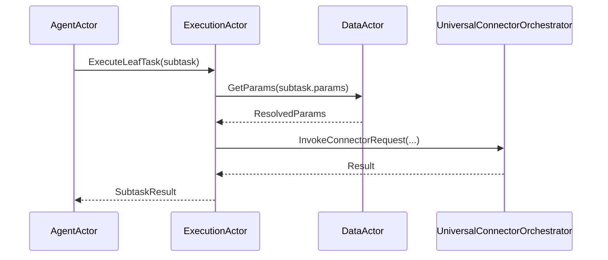
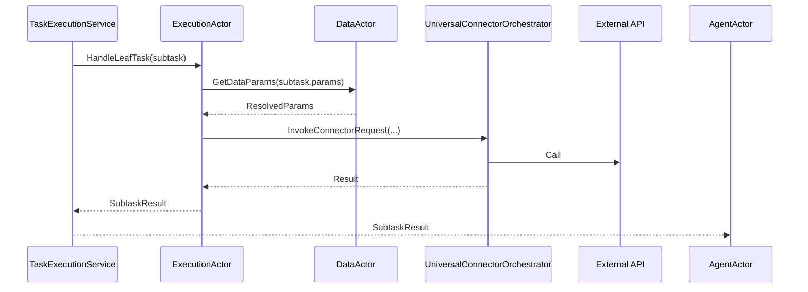
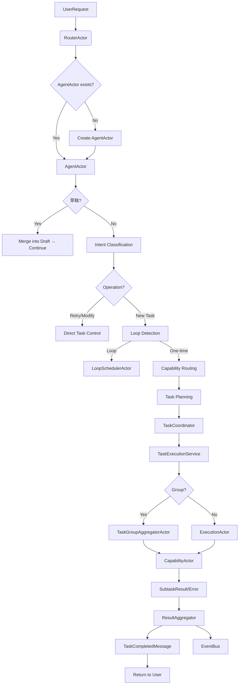
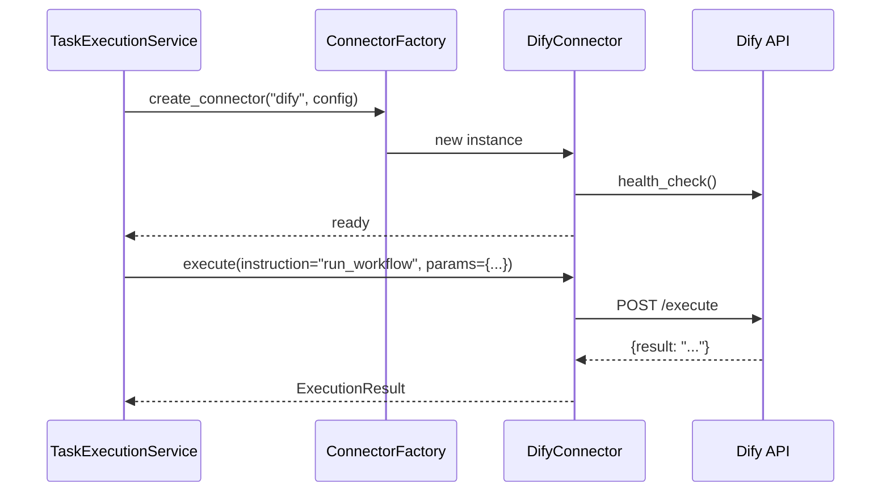
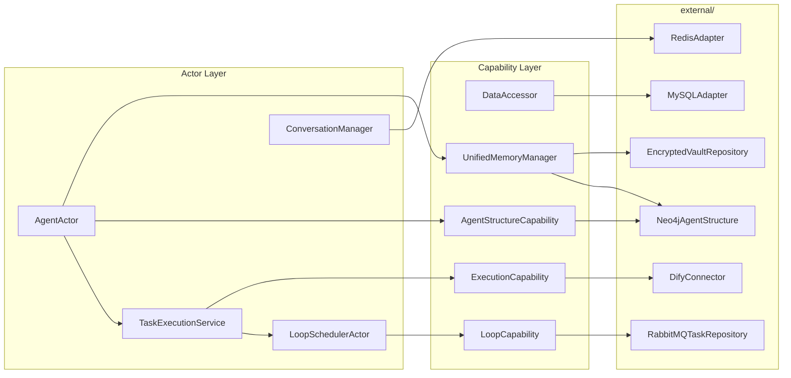
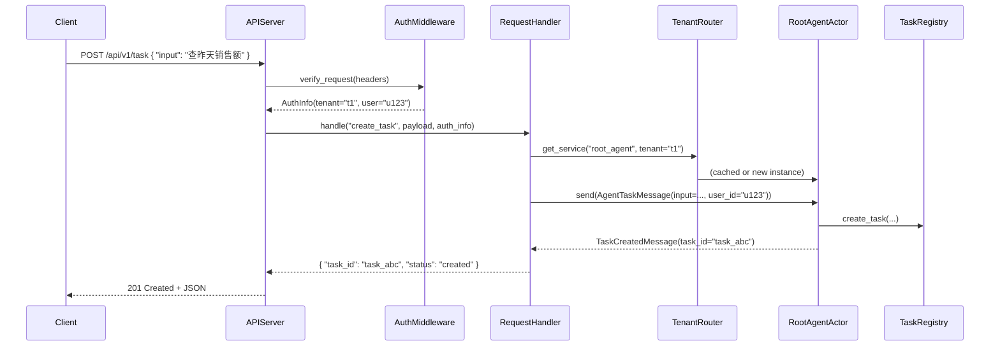

你的整体架构说明非常详尽，已经具备了大型智能体系统（Agent System）所需的模块化、分层设计和可扩展性。不过，在整合过程中确实容易出现**职责不清、依赖混乱、流程断裂**等问题。以下是我基于你提供的文档，从**架构合理性、模块归属、逻辑一致性、潜在耦合/冗余**等角度梳理出的问题与建议：

------

## 🔴 一、核心问题：`agent_actor.py` 职责过重（违反单一职责原则）

### 问题描述：

`AgentActor` 目前承担了：

- 用户意图识别（调用 Qwen）
- 草稿管理（调用 `ConversationManager`）
- 任务路由（调用 `TaskRouter`）
- 子任务规划（调用 `TaskPlanner`）
- 执行分发（调用 `TaskExecutionService`）
- 结果聚合（调用 `ResultAggregator`）
- 记忆写入（调用 `MemoryCapability`）
- 循环任务交互（调用 `LoopSchedulerActor`）

这使其成为一个“上帝类”（God Class），不仅难以测试、维护，还导致 **状态管理复杂、错误传播路径模糊**。

### 建议重构方向：

1. 拆解意图处理逻辑

    → 移入独立的 

   ```
   IntentProcessorActor
   ```

   - 专门负责：澄清、分类、草稿判断
   - 输出标准化的 `ResolvedIntentMessage`

2. 将任务规划与执行分离

   - `AgentActor` 只负责接收用户请求并生成“主任务”
   - 规划（Planning）交给 `TaskPlannerActor`
   - 执行（Execution）交给 `TaskExecutionService`

3. **结果聚合应由专用 Actor 完成**（如 `ResultAggregatorActor`），而非在 `AgentActor` 中硬编码 `_finalize_aggregation`

> ✅ **好处**：每个 Actor 职责单一，消息流清晰（UserRequest → Intent → Plan → Execute → Aggregate → Respond）

------

## 🟠 二、模块归属混乱：`Capabilities/Actor` vs `Agents/`

### 问题点：

- `memory_actor.py`、`data_actor.py`、`mcp_actor.py` 等被放在 `Capabilities/Actor` 文件夹
- 但它们本质上是 **能力执行单元（Capability Executors）**，属于“服务提供者”
- 而 `agent_actor.py` 是“任务协调者”

然而，`agent_memory_actor.py`（在 `Agents/` 下）又试图整合记忆与任务处理，造成 **功能重叠**

### 具体冲突：

- `agent_memory_actor.py` 的 `_handle_task` 会检索记忆并执行任务
- 但 `execution_actor.py` 也会通过 `DataActor` 获取参数并执行任务
- **谁负责“带记忆的任务执行”？逻辑分散！**

### 建议：

1. **统一执行入口**：所有任务执行都通过 `TaskExecutionService`

2. 记忆作为上下文注入

   ：

   - `AgentActor` 在分发任务前，先调用 `MemoryActor.retrieve()` 获取上下文
   - 将上下文作为 `task.context` 传给 `TaskExecutionService`

3. 删除 `agent_memory_actor.py`

   ，其功能拆解到：

   - `MemoryActor`（纯记忆操作）
   - `AgentActor`（调用记忆）
   - `TaskExecutionService`（使用记忆上下文）

> 💡 原则：**Actor 不应同时是“协调者”又是“能力执行者”**，除非是叶子节点（但叶子执行应由通用 `ExecutionActor` 处理）

------

## 🟠 三、`TaskCoordinator` 与 `TaskExecutionService` 职责边界模糊

### 当前设计：

- `TaskCoordinator`（在 `coordination/`）负责子任务生成与状态跟踪
- `TaskExecutionService`（在 `Capabilities/`）负责实际执行

但两者都涉及“任务状态更新”、“子任务管理”，容易出现 **状态不一致**

### 风险：

- 如果 `TaskExecutionService` 直接更新 `TaskRegistry`，而 `TaskCoordinator` 也维护自己的 `active_tasks`，会导致 **双源真相（Dual Source of Truth）**

### 建议：

- **`TaskCoordinator` 应作为唯一任务状态管理者**

- ```
  TaskExecutionService
  ```

  只负责执行，不管理状态

  - 执行完成后，发送 `SubtaskResultMessage` 给 `TaskCoordinator`
  - 由 `TaskCoordinator` 更新状态、触发聚合

> ✅ 这样符合 Actor 模型的“状态封闭”原则：每个 Actor 拥有自己的状态，通过消息通信

------

## 🟢 四、好消息：事件系统设计合理

- `EventBus` + `EventActor` 的发布订阅机制清晰
- 事件类型枚举完整，支持任务、智能体、数据等维度
- 与 Thespian Actor 模型兼容（通过消息传递事件）

✅ 这部分可以保留，只需确保所有关键操作（如任务创建、完成）都发布事件即可。

------

## 🔵 五、潜在性能瓶颈：Redis 作为 Actor 引用存储

### 问题：

- `RouterActor` 依赖 Redis 存储 `ActorAddress`
- 每次用户请求都要查 Redis（即使有本地缓存）
- 在高并发下可能成为瓶颈

### 建议：

1. 本地缓存 + Redis 二级缓存
   - 使用 `TTLCache` 缓存 `tenant_id + node_id → ActorAddress`
   - Redis 仅用于跨实例共享（多进程/多机器部署时）
2. 心跳 TTL 刷新优化
   - 当前每次心跳都 `refresh_ttl`，可改为“滑动窗口”：仅当剩余 TTL < 50% 时才刷新

------

## 🟣 六、命名与抽象层级不一致

### 示例：

- `agent_registry.py` 实际上是 **Actor 创建代理**，不是传统“注册表”
- `TreeManager` 在 `tree/` 下，但又被 `AgentRegistry` 封装，导致 **两层抽象**

### 建议：

- 将 `AgentRegistry` 重命名为 `AgentActorFactory` 或 `AgentProxyManager`
- `TreeManager` 应直接暴露给需要树结构的模块（如 `TaskRouter`），避免过度封装

------

## ✅ 总结：整合建议清单

| 问题                  | 建议                                                      |
| --------------------- | --------------------------------------------------------- |
| `AgentActor` 职责过重 | 拆分为 IntentProcessor + Planner + Coordinator            |
| 记忆与任务执行耦合    | 统一由 `TaskExecutionService` 执行，记忆作为上下文传入    |
| 状态管理分散          | `TaskCoordinator` 作为唯一任务状态源                      |
| 模块归属混乱          | `Capabilities/Actor` 只放能力执行者，`Agents/` 只放协调者 |
| Redis 依赖过重        | 加本地缓存，减少 Redis 查询                               |
| 命名不准确            | 重命名 `AgentRegistry` → `AgentActorFactory`              |

------

如果你能按上述思路调整模块边界和消息流，整个系统会更容易统合、调试和扩展。需要我帮你画一张**重构后的消息流程图**或**模块依赖图**吗？

你的整体架构说明非常详尽，已经具备了大型智能体系统（Agent System）所需的模块化、分层设计和可扩展性。不过，在整合过程中确实容易出现**职责不清、依赖混乱、流程断裂**等问题。以下是我基于你提供的文档，从**架构合理性、模块归属、逻辑一致性、潜在耦合/冗余**等角度梳理出的问题与建议：

------

## 🔴 一、核心问题：`agent_actor.py` 职责过重（违反单一职责原则）

### 问题描述：

`AgentActor` 目前承担了：

- 用户意图识别（调用 Qwen）
- 草稿管理（调用 `ConversationManager`）
- 任务路由（调用 `TaskRouter`）
- 子任务规划（调用 `TaskPlanner`）
- 执行分发（调用 `TaskExecutionService`）
- 结果聚合（调用 `ResultAggregator`）
- 记忆写入（调用 `MemoryCapability`）
- 循环任务交互（调用 `LoopSchedulerActor`）

这使其成为一个“上帝类”（God Class），不仅难以测试、维护，还导致 **状态管理复杂、错误传播路径模糊**。

### 建议重构方向：

1. 拆解意图处理逻辑

    → 移入独立的 

   ```
   IntentProcessorActor
   ```

   - 专门负责：澄清、分类、草稿判断
   - 输出标准化的 `ResolvedIntentMessage`

2. 将任务规划与执行分离

   - `AgentActor` 只负责接收用户请求并生成“主任务”
   - 规划（Planning）交给 `TaskPlannerActor`
   - 执行（Execution）交给 `TaskExecutionService`

3. **结果聚合应由专用 Actor 完成**（如 `ResultAggregatorActor`），而非在 `AgentActor` 中硬编码 `_finalize_aggregation`

> ✅ **好处**：每个 Actor 职责单一，消息流清晰（UserRequest → Intent → Plan → Execute → Aggregate → Respond）

------

## 🟠 二、模块归属混乱：`Capabilities/Actor` vs `Agents/`

### 问题点：

- `memory_actor.py`、`data_actor.py`、`mcp_actor.py` 等被放在 `Capabilities/Actor` 文件夹
- 但它们本质上是 **能力执行单元（Capability Executors）**，属于“服务提供者”
- 而 `agent_actor.py` 是“任务协调者”

然而，`agent_memory_actor.py`（在 `Agents/` 下）又试图整合记忆与任务处理，造成 **功能重叠**

### 具体冲突：

- `agent_memory_actor.py` 的 `_handle_task` 会检索记忆并执行任务
- 但 `execution_actor.py` 也会通过 `DataActor` 获取参数并执行任务
- **谁负责“带记忆的任务执行”？逻辑分散！**

### 建议：

1. **统一执行入口**：所有任务执行都通过 `TaskExecutionService`

2. 记忆作为上下文注入

   ：

   - `AgentActor` 在分发任务前，先调用 `MemoryActor.retrieve()` 获取上下文
   - 将上下文作为 `task.context` 传给 `TaskExecutionService`

3. 删除 `agent_memory_actor.py`

   ，其功能拆解到：

   - `MemoryActor`（纯记忆操作）
   - `AgentActor`（调用记忆）
   - `TaskExecutionService`（使用记忆上下文）

> 💡 原则：**Actor 不应同时是“协调者”又是“能力执行者”**，除非是叶子节点（但叶子执行应由通用 `ExecutionActor` 处理）

------

## 🟠 三、`TaskCoordinator` 与 `TaskExecutionService` 职责边界模糊

### 当前设计：

- `TaskCoordinator`（在 `coordination/`）负责子任务生成与状态跟踪
- `TaskExecutionService`（在 `Capabilities/`）负责实际执行

但两者都涉及“任务状态更新”、“子任务管理”，容易出现 **状态不一致**

### 风险：

- 如果 `TaskExecutionService` 直接更新 `TaskRegistry`，而 `TaskCoordinator` 也维护自己的 `active_tasks`，会导致 **双源真相（Dual Source of Truth）**

### 建议：

- **`TaskCoordinator` 应作为唯一任务状态管理者**

- ```
  TaskExecutionService
  ```

  只负责执行，不管理状态

  - 执行完成后，发送 `SubtaskResultMessage` 给 `TaskCoordinator`
  - 由 `TaskCoordinator` 更新状态、触发聚合

> ✅ 这样符合 Actor 模型的“状态封闭”原则：每个 Actor 拥有自己的状态，通过消息通信

------

## 🟢 四、好消息：事件系统设计合理

- `EventBus` + `EventActor` 的发布订阅机制清晰
- 事件类型枚举完整，支持任务、智能体、数据等维度
- 与 Thespian Actor 模型兼容（通过消息传递事件）

✅ 这部分可以保留，只需确保所有关键操作（如任务创建、完成）都发布事件即可。

------

## 🔵 五、潜在性能瓶颈：Redis 作为 Actor 引用存储

### 问题：

- `RouterActor` 依赖 Redis 存储 `ActorAddress`
- 每次用户请求都要查 Redis（即使有本地缓存）
- 在高并发下可能成为瓶颈

### 建议：

1. 本地缓存 + Redis 二级缓存
   - 使用 `TTLCache` 缓存 `tenant_id + node_id → ActorAddress`
   - Redis 仅用于跨实例共享（多进程/多机器部署时）
2. 心跳 TTL 刷新优化
   - 当前每次心跳都 `refresh_ttl`，可改为“滑动窗口”：仅当剩余 TTL < 50% 时才刷新

------

## 🟣 六、命名与抽象层级不一致

### 示例：

- `agent_registry.py` 实际上是 **Actor 创建代理**，不是传统“注册表”
- `TreeManager` 在 `tree/` 下，但又被 `AgentRegistry` 封装，导致 **两层抽象**

### 建议：

- 将 `AgentRegistry` 重命名为 `AgentActorFactory` 或 `AgentProxyManager`
- `TreeManager` 应直接暴露给需要树结构的模块（如 `TaskRouter`），避免过度封装

------

## ✅ 总结：整合建议清单

| 问题                  | 建议                                                      |
| --------------------- | --------------------------------------------------------- |
| `AgentActor` 职责过重 | 拆分为 IntentProcessor + Planner + Coordinator            |
| 记忆与任务执行耦合    | 统一由 `TaskExecutionService` 执行，记忆作为上下文传入    |
| 状态管理分散          | `TaskCoordinator` 作为唯一任务状态源                      |
| 模块归属混乱          | `Capabilities/Actor` 只放能力执行者，`Agents/` 只放协调者 |
| Redis 依赖过重        | 加本地缓存，减少 Redis 查询                               |
| 命名不准确            | 重命名 `AgentRegistry` → `AgentActorFactory`              |

------

如果你能按上述思路调整模块边界和消息流，整个系统会更容易统合、调试和扩展。需要我帮你画一张**重构后的消息流程图**或**模块依赖图**吗？

非常好！我们现在聚焦在 **AgentActor 与 CapabilityActor 之间的关系**，这是整个系统任务执行的核心桥梁。我们将从你提供的代码结构出发，**一步步细化交互逻辑、消息流、职责边界和数据契约**。

------

## 🎯 目标明确

我们要回答：

> **当 `AgentActor` 决定将一个子任务交给某个能力（capability）执行时，它是如何与对应的 `CapabilityActor`（如 `DataActor`, `DifyCapabilityActor`, `MCPCapabilityActor` 等）交互的？**

具体包括：

- 如何选择正确的 `CapabilityActor`
- 如何传递任务参数
- 如何接收结果或错误
- 如何支持重试、超时、聚合等机制

------

## 第一步：理解 Capability 的注册与发现机制

### ✅ 能力注册表（`capability_registry.py`）

虽然你没贴出该文件，但从上下文可知：

```python
# capability_registry.py (假设)
CAPABILITY_REGISTRY = {
    "data_query": {"actor_class": DataActor, "params": {...}},
    "dify_workflow": {"actor_class": DifyCapabilityActor, ...},
    "mcp_control": {"actor_class": MCPCapabilityActor, ...},
    "memory_store": {"actor_class": MemoryActor, ...}
}
```

每个 capability name 对应一个 **Actor 类** 和元信息。

> 🔑 关键点：`AgentActor` 不直接知道 `DataActor`，而是通过 **capability name** 查找应使用的 Actor 类。

------

## 第二步：AgentActor 如何路由到 CapabilityActor？

### 场景：处理叶子任务（leaf task）

在 `agent_actor.py` 中，当 `_handle_new_task` 或 `_handle_execution_result` 触发子任务执行时，最终会调用类似逻辑：

```python
# agent_actor.py (伪代码)
def _execute_leaf_task(self, subtask: Subtask, sender):
    capability_name = subtask.capability_name  # e.g., "data_query"
    
    # 1. 从 registry 获取对应 Actor 类
    actor_class = capability_registry.get(capability_name)
    if not actor_class:
        raise CapabilityNotFoundError(capability_name)

    # 2. 创建或复用 CapabilityActor 实例（通常每次任务新建）
    cap_actor_ref = self.createActor(actor_class)

    # 3. 构造执行请求消息
    exec_msg = CapabilityExecuteRequest(
        task_id=subtask.id,
        capability=capability_name,
        params=subtask.params,          # 原始参数（可能含占位符）
        context=self.context            # 包含 session_id, user_id, memory 等
    )

    # 4. 发送消息，并记录回调（用于结果聚合）
    self._pending_subtasks[subtask.id] = {
        "sender": sender,
        "aggregator_ref": self.aggregator_ref  # 可选
    }
    cap_actor_ref.tell(exec_msg, sender=self.myAddress)
```

> ✅ 此时 `AgentActor` 成为 **消息发送者（sender）**，`CapabilityActor` 是 **接收者**。

------

## 第三步：CapabilityActor 如何处理请求？

以 `DataActor` 为例（`data_actor.py`）：

```python
class DataActor(Actor):
    def receiveMessage(self, message, sender):
        if isinstance(message, CapabilityExecuteRequest):
            self._handle_capability_request(message, sender)

    def _handle_capability_request(self, msg: CapabilityExecuteRequest, sender):
        try:
            # 1. 解析参数（可能需要从 memory 补全）
            resolved_params = ContextResolver.resolve(
                spec=msg.params,
                context=msg.context
            )

            # 2. 调用底层能力（如 MySQLBusinessData.query）
            result = self.data_access.query(**resolved_params)

            # 3. 返回成功结果
            response = SubtaskResult(
                task_id=msg.task_id,
                result=result,
                capability=msg.capability
            )
            self.send(sender, response)

        except Exception as e:
            error = SubtaskError(
                task_id=msg.task_id,
                error=str(e),
                capability=msg.capability
            )
            self.send(sender, error)
```

> ✅ 所有 `CapabilityActor` 遵循统一接口：
>
> - 输入：`CapabilityExecuteRequest`
> - 输出：`SubtaskResult` 或 `SubtaskError`

------

## 第四步：AgentActor 如何接收结果并聚合？

回到 `agent_actor.py` 的 `receiveMessage`：

```python
def receiveMessage(self, message, sender):
    if isinstance(message, SubtaskResult):
        self._handle_execution_result(message, sender)
    elif isinstance(message, SubtaskError):
        self._handle_execution_error(message, sender)

def _handle_execution_result(self, result_msg: SubtaskResult, sender):
    task_id = result_msg.task_id
    pending = self._pending_subtasks.pop(task_id, None)
    
    if not pending:
        return  # 可能已超时或重复响应

    # 将结果交给聚合器（可能是自己，也可能是独立 AggregatorActor）
    aggregator = pending.get("aggregator_ref") or self
    aggregator.tell(result_msg, sender=self.myAddress)
```

> 🔁 如果使用了 `ResultAggregatorActor`（例如并行任务），则 `AgentActor` 会把结果转发给它；否则自己聚合。

------

## 第五步：特殊场景处理

### 场景1：需要参数补全（从记忆/上下文）

- ```
  ContextResolver
  ```

  （在 

  ```
  capabilities/routing/context_resolver.py
  ```

  ）负责：

  - 识别参数中的占位符（如 `{user_name}`）
  - 从 `MemoryActor` 查询短期/长期记忆
  - 从 `ConversationManager` 获取对话历史
  - 返回完整参数字典

> ✅ `CapabilityActor` 在执行前调用 `ContextResolver.resolve()`，而非 `AgentActor`。

### 场景2：能力不存在 → 回退到 MCP

```python
# agent_actor.py
if capability_name not in capability_registry:
    mcp_actor = self.createActor(MCPCapabilityActor)
    mcp_actor.tell(FallbackRequest(original_task=subtask), sender=self.myAddress)
```

### 场景3：连接器类能力（如 UniversalConnectorOrchestrator）

对于通用连接器，`ExecutionActor` 会作为中介：



> ✅ `ExecutionActor` 是 **叶子任务的统一入口**，它协调 `DataActor`（取参）和 `UniversalConnectorOrchestrator`（执行）。

------

## 第六步：关键消息类型定义（建议）

为保证类型安全，建议定义以下 Pydantic 模型：

```python
# messages/capability.py
class CapabilityExecuteRequest(BaseModel):
    task_id: str
    capability: str
    params: Dict[str, Any]
    context: TaskContext  # 包含 session_id, user_id, memory_key 等

class SubtaskResult(BaseModel):
    task_id: str
    result: Any
    capability: str
    timestamp: datetime = Field(default_factory=datetime.utcnow)

class SubtaskError(BaseModel):
    task_id: str
    error: str
    capability: str
    timestamp: datetime = Field(default_factory=datetime.utcnow)
```

所有 `CapabilityActor` 必须遵守此契约。

------

## 第七步：生命周期与资源管理

| 问题                       | 解决方案                                                     |
| -------------------------- | ------------------------------------------------------------ |
| CapabilityActor 是否常驻？ | **否**。通常按任务创建，执行完自动销毁（Thespian 默认行为）  |
| 如何避免重复创建？         | 对于状态型能力（如 MemoryActor），可通过 `RouterActor` 或单例模式管理 |
| 如何处理长时间运行任务？   | 使用 `TaskExecutionService` + 异步队列，CapabilityActor 只做调度 |

------

## ✅ 总结：AgentActor 与 CapabilityActor 交互流程

```mermaid
flowchart TD
    A[AgentActor] -->|1. 根据 capability_name| B[capability_registry]
    B -->|2. 返回 Actor Class| A
    A -->|3. createActor(DataActor)| C[DataActor]
    A -->|4. send(CapabilityExecuteRequest)| C
    C -->|5. resolve params via ContextResolver| D[MemoryActor / Conversation]
    C -->|6. execute data query| E[MySQLBusinessData]
    C -->|7. send(SubtaskResult)| A
    A -->|8. forward to Aggregator| F[ResultAggregatorActor]
    F -->|9. publish TaskCompleted| G[EventBus]
```

------

## 🔜 下一步建议

现在我们已经理清了 **Agent ↔ Capability** 的核心交互。接下来你可以选择继续细化：

1. **ContextResolver 如何工作？**（参数补全过程）
2. **ResultAggregatorActor 的嵌套聚合机制**
3. **ExecutionActor 与 UniversalConnectorOrchestrator 的协作细节**
4. **循环任务中 LoopSchedulerActor 如何触发 AgentActor**

请告诉我你想深入哪一个部分，我们可以继续“一步步”拆解！


非常好！我们现在站在一个非常清晰的系统视图上。你已经完整地描述了 **从用户输入到任务执行再到结果返回** 的端到端流程，并且明确了各模块的职责边界。

接下来，我们将 **聚焦于“数据流转”和“消息驱动”的核心机制**，特别是：

> **在整个流程中，Message 是如何在各个 Actor 之间传递的？Task 是如何被创建、拆解、分发、执行、聚合的？草稿（Draft）又是如何与 Task 关联并影响流程走向的？**

我们将严格按照你设计的 12 步流程，逐层展开，结合 `Common` 中的消息定义、`Agents` 中的 Actor 实现、以及 `Capabilities` 中的能力调用，构建一张 **完整的数据流 + 控制流图谱**。

------

## 🧭 总览：三大核心实体

| 实体        | 职责                                     | 存储位置           |
| ----------- | ---------------------------------------- | ------------------ |
| **Message** | 异步通信载体，驱动整个 Actor 系统        | `common/messages/` |
| **Task**    | 任务的逻辑单元，包含状态、参数、父子关系 | `common/tasks/`    |
| **Draft**   | 对话中的暂存状态，用于上下文延续         | `common/draft/`    |

> ✅ 所有交互都通过 **Message 传递 Task 或 Draft 的引用/快照**，而非直接共享内存。

------

## 🔁 第一步：用户输入 → RouterActor → AgentActor

### 消息流：

```python
# 用户请求（HTTP/WebSocket）
UserRequest(
    tenant_id="t1",
    node_id="n1",
    user_input="帮我查一下昨天的销售额"
)

# RouterActor 收到后
→ 构建 key = "agent:t1:n1"
→ 查 Redis / 内存 → 是否存在 AgentActor？
  - 若存在：router.send(existing_ref, UserRequest(...))
  - 若不存在：
      session_actor = createActor(SessionActor)
      agent_actor = createActor(AgentActor, globalName="agent:t1:n1")
      register in Redis with TTL
      forward message to agent_actor
```

> ✅ **RouterActor 不处理业务逻辑，只做路由和生命周期管理**。

------

## 📝 第二步：草稿判断（Draft + ConversationManager）

### 关键组件：

- `TaskDraft`: `{id, action_type, collected_params, missing_params, last_question}`
- `ConversationManager.is_continue_request(user_input)`

### 流程：

```python
# AgentActor._handle_task()
if ConversationManager.is_continue_request(task.user_input):
    draft = ConversationManager.restore_latest_draft(user_id)
    if draft:
        # 合并新输入到草稿
        updated_draft = merge_input_into_draft(draft, task.user_input)
        # 继续原流程（跳过意图识别，直接进入参数补全或执行）
        self._continue_from_draft(updated_draft, sender)
        return
```

### 消息关联：

- 草稿本身 **不通过 Message 传递**，而是由 `ConversationManager` 在本地内存/Redis 中管理。
- 但 **草稿恢复后的任务** 会以 `AgentTaskMessage` 形式重新进入主流程。

> ✅ 草稿是 **对话状态的快照**，不是独立任务，它会被“注入”到新任务上下文中。

------

## 🎯 第三步：意图判断（IntentRouter + QwenAdapter）

### 消息输入：

- `AgentTaskMessage(user_input="...", context=...)`

### 处理：

```python
intent = classify_intent_with_qwen(user_input, memory_context)
# 返回: "task", "query", "chat", "continue_draft", "ambiguous"...

if intent == "ambiguous":
    options = generate_clarification_options(user_input)
    msg = ClarificationMessage(options=options)
    self.send(sender, msg)  # 直接返回给前端
    return
```

### 输出消息：

- 若明确意图 → 继续流程
- 若模糊 → 返回 `ClarificationMessage`（属于 `agent_messages.py`）

> ✅ **意图判断不产生新 Task，只是决定下一步分支**。

------

## ⚙️ 第四步：任务操作判断（_llm_classify_task_operation）

### 输入：

- 已知是 “task” 意图
- 用户输入如：“重试刚才那个任务”、“把循环间隔改成1小时”

### 处理：

```python
operation = _llm_classify_task_operation(user_input, recent_tasks)

if operation.type == "retry":
    target_task = find_task_by_reference(operation.ref)
    self._retry_task(target_task)
elif operation.type == "modify_loop":
    self.send(LoopSchedulerActor, ModifyLoopIntervalRequest(...))
elif operation.type == "new":
    self._handle_new_task(...)
```

### 消息交互：

- **修改/重试**：直接操作 `TaskRegistry`，可能发送 `TaskControlMessage`
- **新任务**：进入主执行流程（④）

> ✅ 此步 **可能短路整个执行链**，不进入规划阶段。

------

## 🔁 第五步：循环任务检测（_llm_decide_task_strategy）

### 判断依据：

- 用户输入含“每天”、“每小时”、“定期”等关键词
- 或 LLM 显式输出 `{"is_loop": true, "interval": "1h"}`

### 分支：

```python
if is_loop:
    loop_msg = RegisterLoopTaskRequest(
        task_spec=task_spec,
        interval="1h",
        tenant_id=...,
        node_id=...
    )
    self.send(LoopSchedulerActor, loop_msg)
    # 直接返回“已设置循环任务”
else:
    proceed to capability routing (⑤)
```

> ✅ 循环任务 **不会立即执行**，而是注册到 `LoopSchedulerActor`，由 RabbitMQ 定时触发。

------

## 🧭 第六步：能力路由（TaskRouter）

### 输入：

- 任务描述（自然语言）
- 当前记忆上下文

### 处理：

```python
best_actor_meta = TaskRouter.select_best_actor(
    task_desc=current_desc,
    context=memory_context,
    strategy="qwen_intelligent"
)

# 返回: {"capability": "data_query", "actor_ref": <ref>}
```

### 输出：

- 若找到 → 进入任务规划（⑥）
- 若未找到 → 发送 `McpFallbackRequest` 到 `MCPCapabilityActor`

> ✅ **TaskRouter 返回的是 capability name + 可选 actor_ref**，不一定新建 Actor。

------

## 🗺️ 第七步：任务规划（TaskPlanner）

### 触发：

- 调用 `capability_registry.get_capability("task_planner")`
- 执行 `planner.plan(task_desc, context)`

### 输出：

```python
subtask_configs = [
    {"capability": "data_query", "params": {"table": "sales", "date": "yesterday"}},
    {"capability": "llm_summarize", "params": {"text": "{{result_0}}"}}
]
```

### 消息生成：

- 每个子任务包装为 `SubtaskSpec`
- 交由 `TaskCoordinator.create_task()` 创建实际 Task 对象

> ✅ **规划结果是结构化的子任务列表**，不是 Message。

------

## 📦 第八步：任务分发（TaskCoordinator + TaskExecutionService）

### 流程：

```python
for config in subtask_configs:
    subtask = TaskCoordinator.create_task(
        parent_id=parent_task.id,
        task_type="leaf",
        context=config
    )
    
    # 发送执行请求
    exec_msg = ExecuteTaskMessage(
        task=subtask,
        executor_capability=config["capability"]
    )
    TaskExecutionService.tell(exec_msg)
```

### 消息类型：

- `ExecuteTaskMessage` → `TaskExecutionService`
- `SubtaskSpawnedMessage` → EventBus（用于监控）

> ✅ **TaskExecutionService 是执行入口**，它决定是自己执行还是转发给 CapabilityActor。

------

## 🔄 第九步：组任务管理（TaskGroupAggregatorActor）

### 触发条件：

- 子任务配置中含 `group_id` 或 `parallel=True`

### 流程：

```python
group_msg = TaskGroupRequest(
    group_id="g1",
    tasks=[subtask1, subtask2, ...],
    retry_policy={"max_retries": 2}
)
aggregator = createActor(TaskGroupAggregatorActor)
aggregator.tell(group_msg)
```

### 消息流：

- Aggregator 向每个 CapabilityActor 发送 `CapabilityExecuteRequest`
- 接收 `SubtaskResult` / `SubtaskError`
- 聚合后发送 `TaskGroupResult` 回 `AgentActor`

> ✅ **支持嵌套聚合**：一个子任务本身可以是一个任务组。

------

## ⚡ 第十步：并行执行判断（ExecutionManager）

### 逻辑：

```python
if ExecutionStrategyManager.should_optimize(task_group):
    optimized_order = OptunaOptimizer.optimize(tasks)
    strategy = "sequential_with_priority"
else:
    strategy = "parallel"
    
ExecutionStrategyManager.execute_with_strategy(strategy, tasks, executor_func)
```

> ✅ 此步通常在 `TaskGroupAggregatorActor` 或 `ExecutionActor` 内部完成。

------

## 🧩 第十一步：单任务执行（TaskExecutionService → CapabilityActor）

### 关键路径：



### 参数解析：

- `ContextResolver.resolve(params, context)` 在 `DataActor` 或 `ExecutionActor` 中调用
- 从 `MemoryActor` 获取 `{user_name}`、`{last_report_id}` 等

> ✅ **叶子任务执行 = 参数补全 + 能力调用**

------

## 📊 第十二步：结果聚合（ResultAggregator）

### 触发：

- 所有子任务完成 → `AgentActor._finalize_aggregation()`
- 或 `ResultAggregatorActor` 收到所有结果

### 聚合策略：

- `map_reduce`：并行执行 + reduce 函数
- `sequential`：按顺序合并
- `majority_vote`：用于多模型投票

### 输出：

```python
final_result = aggregator.aggregate(results)
completed_msg = TaskCompletedMessage(
    task_id=parent_task.id,
    result=final_result
)
self.send(original_sender, completed_msg)
```

------

## 🔔 第十三步：事件通知（EventBus）

### 发布事件：

```python
EventBus.publish(TaskCompletedEvent(
    task_id=...,
    result=...,
    tenant_id=...
))
```

### 订阅者：

- 前端 WebSocket 服务（推送进度）
- 日志审计模块
- 监控告警系统

> ✅ **事件是 fire-and-forget，不影响主流程**

------

## 📤 第十四步：返回结果

- `AgentActor` 将 `TaskCompletedMessage` 发回给最初 `sender`（通常是 `SessionActor` 或 HTTP Bridge）
- 最终由网关转换为 JSON 响应

------

## 🧠 草稿与任务的生命周期绑定

| 场景         | 草稿行为                         |
| ------------ | -------------------------------- |
| 新任务开始   | 清空旧草稿（最多保留3个）        |
| 任务需要追问 | 保存当前参数为草稿，返回澄清问题 |
| 用户继续输入 | 恢复草稿，合并新输入             |
| 任务成功完成 | 删除相关草稿                     |
| 任务失败     | 保留草稿，供重试使用             |

> ✅ 草稿是 **任务执行过程中的中间状态缓存**，由 `ConversationManager` 管理，与 `TaskRegistry` 解耦。

------

## ✅ 总结：Message 与 Task 的流转全景



------

## 🔜 下一步建议

现在我们已经完整梳理了 **控制流 + 数据流 + 消息契约**。接下来你可以选择深入：

1. **草稿的存储格式与恢复机制细节**（Redis 结构？序列化方式？）
2. **TaskCoordinator 如何管理父子任务依赖？**
3. **ResultAggregator 的嵌套聚合实现（递归聚合器）**
4. **ContextResolver 的参数补全过程（如何从 memory 提取 `{xxx}`）**

请告诉我你想深挖哪一块，我们可以继续“显微镜级”拆解！


非常好！我们现在站在一个非常清晰的系统视图上。你已经完整地描述了 **从用户输入到任务执行再到结果返回** 的端到端流程，并且明确了各模块的职责边界。

接下来，我们将 **聚焦于“数据流转”和“消息驱动”的核心机制**，特别是：

> **在整个流程中，Message 是如何在各个 Actor 之间传递的？Task 是如何被创建、拆解、分发、执行、聚合的？草稿（Draft）又是如何与 Task 关联并影响流程走向的？**

我们将严格按照你设计的 12 步流程，逐层展开，结合 `Common` 中的消息定义、`Agents` 中的 Actor 实现、以及 `Capabilities` 中的能力调用，构建一张 **完整的数据流 + 控制流图谱**。

------

## 🧭 总览：三大核心实体

| 实体        | 职责                                     | 存储位置           |
| ----------- | ---------------------------------------- | ------------------ |
| **Message** | 异步通信载体，驱动整个 Actor 系统        | `common/messages/` |
| **Task**    | 任务的逻辑单元，包含状态、参数、父子关系 | `common/tasks/`    |
| **Draft**   | 对话中的暂存状态，用于上下文延续         | `common/draft/`    |

> ✅ 所有交互都通过 **Message 传递 Task 或 Draft 的引用/快照**，而非直接共享内存。

------

## 🔁 第一步：用户输入 → RouterActor → AgentActor

### 消息流：

```python
# 用户请求（HTTP/WebSocket）
UserRequest(
    tenant_id="t1",
    node_id="n1",
    user_input="帮我查一下昨天的销售额"
)

# RouterActor 收到后
→ 构建 key = "agent:t1:n1"
→ 查 Redis / 内存 → 是否存在 AgentActor？
  - 若存在：router.send(existing_ref, UserRequest(...))
  - 若不存在：
      session_actor = createActor(SessionActor)
      agent_actor = createActor(AgentActor, globalName="agent:t1:n1")
      register in Redis with TTL
      forward message to agent_actor
```

> ✅ **RouterActor 不处理业务逻辑，只做路由和生命周期管理**。

------

## 📝 第二步：草稿判断（Draft + ConversationManager）

### 关键组件：

- `TaskDraft`: `{id, action_type, collected_params, missing_params, last_question}`
- `ConversationManager.is_continue_request(user_input)`

### 流程：

```python
# AgentActor._handle_task()
if ConversationManager.is_continue_request(task.user_input):
    draft = ConversationManager.restore_latest_draft(user_id)
    if draft:
        # 合并新输入到草稿
        updated_draft = merge_input_into_draft(draft, task.user_input)
        # 继续原流程（跳过意图识别，直接进入参数补全或执行）
        self._continue_from_draft(updated_draft, sender)
        return
```

### 消息关联：

- 草稿本身 **不通过 Message 传递**，而是由 `ConversationManager` 在本地内存/Redis 中管理。
- 但 **草稿恢复后的任务** 会以 `AgentTaskMessage` 形式重新进入主流程。

> ✅ 草稿是 **对话状态的快照**，不是独立任务，它会被“注入”到新任务上下文中。

------

## 🎯 第三步：意图判断（IntentRouter + QwenAdapter）

### 消息输入：

- `AgentTaskMessage(user_input="...", context=...)`

### 处理：

```python
intent = classify_intent_with_qwen(user_input, memory_context)
# 返回: "task", "query", "chat", "continue_draft", "ambiguous"...

if intent == "ambiguous":
    options = generate_clarification_options(user_input)
    msg = ClarificationMessage(options=options)
    self.send(sender, msg)  # 直接返回给前端
    return
```

### 输出消息：

- 若明确意图 → 继续流程
- 若模糊 → 返回 `ClarificationMessage`（属于 `agent_messages.py`）

> ✅ **意图判断不产生新 Task，只是决定下一步分支**。

------

## ⚙️ 第四步：任务操作判断（_llm_classify_task_operation）

### 输入：

- 已知是 “task” 意图
- 用户输入如：“重试刚才那个任务”、“把循环间隔改成1小时”

### 处理：

```python
operation = _llm_classify_task_operation(user_input, recent_tasks)

if operation.type == "retry":
    target_task = find_task_by_reference(operation.ref)
    self._retry_task(target_task)
elif operation.type == "modify_loop":
    self.send(LoopSchedulerActor, ModifyLoopIntervalRequest(...))
elif operation.type == "new":
    self._handle_new_task(...)
```

### 消息交互：

- **修改/重试**：直接操作 `TaskRegistry`，可能发送 `TaskControlMessage`
- **新任务**：进入主执行流程（④）

> ✅ 此步 **可能短路整个执行链**，不进入规划阶段。

------

## 🔁 第五步：循环任务检测（_llm_decide_task_strategy）

### 判断依据：

- 用户输入含“每天”、“每小时”、“定期”等关键词
- 或 LLM 显式输出 `{"is_loop": true, "interval": "1h"}`

### 分支：

```python
if is_loop:
    loop_msg = RegisterLoopTaskRequest(
        task_spec=task_spec,
        interval="1h",
        tenant_id=...,
        node_id=...
    )
    self.send(LoopSchedulerActor, loop_msg)
    # 直接返回“已设置循环任务”
else:
    proceed to capability routing (⑤)
```

> ✅ 循环任务 **不会立即执行**，而是注册到 `LoopSchedulerActor`，由 RabbitMQ 定时触发。

------

## 🧭 第六步：能力路由（TaskRouter）

### 输入：

- 任务描述（自然语言）
- 当前记忆上下文

### 处理：

```python
best_actor_meta = TaskRouter.select_best_actor(
    task_desc=current_desc,
    context=memory_context,
    strategy="qwen_intelligent"
)

# 返回: {"capability": "data_query", "actor_ref": <ref>}
```

### 输出：

- 若找到 → 进入任务规划（⑥）
- 若未找到 → 发送 `McpFallbackRequest` 到 `MCPCapabilityActor`

> ✅ **TaskRouter 返回的是 capability name + 可选 actor_ref**，不一定新建 Actor。

------

## 🗺️ 第七步：任务规划（TaskPlanner）

### 触发：

- 调用 `capability_registry.get_capability("task_planner")`
- 执行 `planner.plan(task_desc, context)`

### 输出：

```python
subtask_configs = [
    {"capability": "data_query", "params": {"table": "sales", "date": "yesterday"}},
    {"capability": "llm_summarize", "params": {"text": "{{result_0}}"}}
]
```

### 消息生成：

- 每个子任务包装为 `SubtaskSpec`
- 交由 `TaskCoordinator.create_task()` 创建实际 Task 对象

> ✅ **规划结果是结构化的子任务列表**，不是 Message。

------

## 📦 第八步：任务分发（TaskCoordinator + TaskExecutionService）

### 流程：

```python
for config in subtask_configs:
    subtask = TaskCoordinator.create_task(
        parent_id=parent_task.id,
        task_type="leaf",
        context=config
    )
    
    # 发送执行请求
    exec_msg = ExecuteTaskMessage(
        task=subtask,
        executor_capability=config["capability"]
    )
    TaskExecutionService.tell(exec_msg)
```

### 消息类型：

- `ExecuteTaskMessage` → `TaskExecutionService`
- `SubtaskSpawnedMessage` → EventBus（用于监控）

> ✅ **TaskExecutionService 是执行入口**，它决定是自己执行还是转发给 CapabilityActor。

------

## 🔄 第九步：组任务管理（TaskGroupAggregatorActor）

### 触发条件：

- 子任务配置中含 `group_id` 或 `parallel=True`

### 流程：

```python
group_msg = TaskGroupRequest(
    group_id="g1",
    tasks=[subtask1, subtask2, ...],
    retry_policy={"max_retries": 2}
)
aggregator = createActor(TaskGroupAggregatorActor)
aggregator.tell(group_msg)
```

### 消息流：

- Aggregator 向每个 CapabilityActor 发送 `CapabilityExecuteRequest`
- 接收 `SubtaskResult` / `SubtaskError`
- 聚合后发送 `TaskGroupResult` 回 `AgentActor`

> ✅ **支持嵌套聚合**：一个子任务本身可以是一个任务组。

------

## ⚡ 第十步：并行执行判断（ExecutionManager）

### 逻辑：

```python
if ExecutionStrategyManager.should_optimize(task_group):
    optimized_order = OptunaOptimizer.optimize(tasks)
    strategy = "sequential_with_priority"
else:
    strategy = "parallel"
    
ExecutionStrategyManager.execute_with_strategy(strategy, tasks, executor_func)
```

> ✅ 此步通常在 `TaskGroupAggregatorActor` 或 `ExecutionActor` 内部完成。

------

## 🧩 第十一步：单任务执行（TaskExecutionService → CapabilityActor）

### 关键路径：


### 参数解析：

- `ContextResolver.resolve(params, context)` 在 `DataActor` 或 `ExecutionActor` 中调用
- 从 `MemoryActor` 获取 `{user_name}`、`{last_report_id}` 等

> ✅ **叶子任务执行 = 参数补全 + 能力调用**

------

## 📊 第十二步：结果聚合（ResultAggregator）

### 触发：

- 所有子任务完成 → `AgentActor._finalize_aggregation()`
- 或 `ResultAggregatorActor` 收到所有结果

### 聚合策略：

- `map_reduce`：并行执行 + reduce 函数
- `sequential`：按顺序合并
- `majority_vote`：用于多模型投票

### 输出：

```python
final_result = aggregator.aggregate(results)
completed_msg = TaskCompletedMessage(
    task_id=parent_task.id,
    result=final_result
)
self.send(original_sender, completed_msg)
```

------

## 🔔 第十三步：事件通知（EventBus）

### 发布事件：

```python
EventBus.publish(TaskCompletedEvent(
    task_id=...,
    result=...,
    tenant_id=...
))
```

### 订阅者：

- 前端 WebSocket 服务（推送进度）
- 日志审计模块
- 监控告警系统

> ✅ **事件是 fire-and-forget，不影响主流程**

------

## 📤 第十四步：返回结果

- `AgentActor` 将 `TaskCompletedMessage` 发回给最初 `sender`（通常是 `SessionActor` 或 HTTP Bridge）
- 最终由网关转换为 JSON 响应

------

## 🧠 草稿与任务的生命周期绑定

| 场景         | 草稿行为                         |
| ------------ | -------------------------------- |
| 新任务开始   | 清空旧草稿（最多保留3个）        |
| 任务需要追问 | 保存当前参数为草稿，返回澄清问题 |
| 用户继续输入 | 恢复草稿，合并新输入             |
| 任务成功完成 | 删除相关草稿                     |
| 任务失败     | 保留草稿，供重试使用             |

> ✅ 草稿是 **任务执行过程中的中间状态缓存**，由 `ConversationManager` 管理，与 `TaskRegistry` 解耦。

------

## ✅ 总结：Message 与 Task 的流转全景


------

## 🔜 下一步建议

现在我们已经完整梳理了 **控制流 + 数据流 + 消息契约**。接下来你可以选择深入：

1. **草稿的存储格式与恢复机制细节**（Redis 结构？序列化方式？）
2. **TaskCoordinator 如何管理父子任务依赖？**
3. **ResultAggregator 的嵌套聚合实现（递归聚合器）**
4. **ContextResolver 的参数补全过程（如何从 memory 提取 `{xxx}`）**

请告诉我你想深挖哪一块，我们可以继续“显微镜级”拆解！


非常棒！现在我们进入 **Flora Agent 系统的对外连接层（`external/`）**，这是整个系统与“真实世界”交互的桥梁。你已经提供了详尽的模块说明，我们现在要做的，是 **将这些外部连接能力与内部 Capability + Agent 架构打通**，明确：

> **谁在何时、以何种方式调用 `external/` 中的组件？数据如何流入流出？Capability 如何封装这些外部依赖？Agent 又如何感知和使用它们？**

------

## 🧭 一、整体定位：`external/` 是什么？

`external/` 是 **基础设施适配层（Infrastructure Adapter Layer）**，它：

- **不包含业务逻辑**
- **只负责协议转换、连接管理、资源抽象**
- **为上层 Capability 提供统一接口**

> ✅ 它是 **Capability 的“手和脚”**，Capability 是“大脑”，Agent 是“指挥官”。

------

## 🔗 二、关键关系映射表

| 上层组件                                  | 调用的 external 模块                          | 调用目的                           | 调用方式                                           |
| ----------------------------------------- | --------------------------------------------- | ---------------------------------- | -------------------------------------------------- |
| `DataAccessor` (capability)               | `database/`, `business_data/`                 | 查询/写入结构化数据                | 通过 `DatabaseInterface` / `BusinessDataInterface` |
| `UnifiedMemoryManager`                    | `memory_store/`                               | 存取六类记忆（核心/程序/保险库等） | 调用 `build_xxx_repo()` 工厂函数                   |
| `LoopSchedulerActor`                      | `loop/` (`RabbitMQTaskRepository`)            | 注册/取消循环任务                  | 通过 `LoopTaskRepository` 接口                     |
| `TaskExecutionService` → `ExecutionActor` | `execution_connectors/`                       | 调用 Dify、自定义 API、工具链      | 通过 `ConnectorFactory.create_connector()`         |
| `ConversationManager`                     | `internal_storage/` (`SQLiteInternalStorage`) | 持久化草稿、对话状态               | 通过 `InternalStorageInterface.save_task_state()`  |
| `AgentStructureManager`                   | `agent_structure/` (`Neo4jAgentStructure`)    | 管理 Agent 树形拓扑                | 通过 `AgentStructureInterface`                     |
| 所有需要缓存的组件                        | `database/redis_adapter.py`                   | 分布式锁、会话状态、草稿缓存       | 通过 `RedisAdapter.get_client()`                   |

> ✅ **所有调用都通过接口（Interface）进行，实现解耦**。

------

## 🏗️ 三、核心集成模式详解

### 1. **Capability 封装 external 适配器（最常见模式）**

#### 示例：`DataAccessor` 使用 `MySQLAdapter`

```python
# capabilities/data_access/data_accessor.py
class DataAccessor(CapabilityBase):
    def __init__(self, config):
        self.db_adapters = {}
        for source_name, source_config in config["data_sources"].items():
            db_type = source_config["type"]  # e.g., "mysql"
            adapter = create_database_adapter(db_type, source_config)
            adapter.connect()
            self.db_adapters[source_name] = adapter

    def query(self, source_name, sql, params):
        return self.db_adapters[source_name].execute_query(sql, params)
```

> ✅ **Capability 是 external 适配器的“聚合者”和“语义翻译者”**。

------

### 2. **Agent 直接调用 external（较少，仅限基础设施操作）**

#### 示例：`AgentActor` 初始化时加载自身结构

```python
# agents/agent_actor.py
class AgentActor(Actor):
    def receiveMessage(self, msg, sender):
        if isinstance(msg, InitMessage):
            struct_mgr = create_agent_structure(config["agent_structure"])
            self.agent_meta = struct_mgr.get_agent_by_id(self.my_id)
            self.parent_ref = struct_mgr.get_agent_relationship(self.my_id).parent
```

> ⚠️ 这种调用应尽量避免，理想情况是通过 `CapabilityRegistry` 获取 `AgentStructureCapability`。

------

### 3. **Execution Connectors：能力即服务（CaaS）**

这是最关键的集成点！

#### 流程：



#### 能力注册（启动时）：

```python
# 在系统初始化阶段
ConnectorRegistry.register(
    connector_type="dify",
    connector_class=DifyConnector,
    capabilities=["workflow_execution", "form_filling"]
)

CapabilityRegistry.register_class(
    "dify_executor",
    lambda cfg: ConnectorFactory.create_connector("dify", cfg)
)
```

> ✅ **任何外部执行引擎（Dify、n8n、自研工具链）都可通过此模式接入**。

------

### 4. **循环任务：external/loop + RabbitMQ Bridge**

#### 数据流：

```
AgentActor 
  → LoopSchedulerActor 
    → RabbitMQTaskRepository.save(task) 
      → RabbitMQ (delayed exchange) 
        → after interval → RabbitBridgeActor 
          → re-sends UserRequest to RouterActor
```

> ✅ **循环任务本质是“定时重放用户请求”**，所以最终仍走主流程。

------

### 5. **记忆存储：external/memory_store 的分层设计**

| 记忆类型       | 存储实现                                        | 是否加密 | 持久化 |
| -------------- | ----------------------------------------------- | -------- | ------ |
| 核心/情景/语义 | `FileBasedProceduralRepository` + SQLite        | 否       | 是     |
| 程序记忆       | `FileBasedProceduralRepository`（带语义索引）   | 否       | 是     |
| 资源记忆       | `ResourceRepository`（MinIO + SQLite metadata） | 否       | 是     |
| 保险库记忆     | `EncryptedVaultRepository`（SQLite + AES）      | 是       | 是     |

> ✅ `UnifiedMemoryManager` 内部根据记忆类型路由到不同 repo。

------

## 🔐 四、安全与配置管理

### 配置注入：

- 所有 `external/` 组件通过 `config_manager.py` 获取配置
- 敏感信息（API key、DB password）从 Vault 或环境变量读取

### 加密：

- `Encryptor` 类统一处理加解密
- 保险库数据在写入 SQLite 前自动加密

### 连接池 & 健康检查：

- MySQL/Redis 使用连接池
- 所有 connectors 实现 `health_check()`，失败时自动熔断

------

## 🧩 五、与内部架构的协同图



> ✅ **箭头方向 = 依赖方向**。Actor 不直接依赖 external，而是通过 Capability。

------

## ✅ 六、总结：`external/` 的设计哲学

1. **接口先行**：所有外部依赖必须实现 Interface

2. **工厂创建**：运行时根据配置动态选择实现（Neo4j vs Memory）

3. **能力封装**：external 组件被 Capability 包装后才暴露给 Agent

4. 关注点分离

   ：

   - `database/`：只管 CRUD
   - `execution_connectors/`：只管调用外部执行器
   - `memory_store/`：只管存取，不管语义

5. **可测试性**：Memory 实现用于单元测试，真实实现用于生产

------

## 🔜 下一步建议

你现在可以决定深入哪个方向：

1. **Execution Connectors 的扩展机制**：如何新增一个 `ZapierConnector`？
2. **Agent Structure 的影响子图计算**：如何用于任务传播或权限控制？
3. **循环任务的可靠性保障**：RabbitMQ 消息丢失怎么办？如何支持 cron 表达式？
4. **记忆存储的语义搜索实现**：`FileBasedProceduralRepository` 如何做 embedding 检索？

请告诉我你想优先探索哪一块，我们可以继续向下钻取！

非常好！现在我们来到了 **Flora 系统对外服务的“门面”层 —— `entry_layer/`**。这一层是整个系统与外部世界（前端、第三方应用、运维工具等）交互的唯一入口。

你已经清晰地描述了四个核心组件：  

- **`api_server.py`**：FastAPI 服务容器  
- **`auth_middleware.py`**：统一认证网关  
- **`request_handler.py`**：业务逻辑调度器  
- **`tenant_router.py`**：多租户服务路由中枢

我们现在要做的，是 **将这些组件与内部 Actor + Capability 架构打通**，并回答：

> **外部请求如何安全、高效、可扩展地转化为内部任务执行？多租户隔离如何实现？各类查询服务的数据从何而来？**

------

## 🧭 一、整体架构定位

`entry_layer/` 是 **面向外部的 API 网关 + 请求分发器**，其核心职责：

| 职责           | 实现方式                                                     |
| -------------- | ------------------------------------------------------------ |
| **协议转换**   | HTTP/JSON ↔ 内部 Message（如 `AgentTaskMessage`）            |
| **认证鉴权**   | JWT/API Key → `AuthInfo(tenant_id, user_id, permissions)`    |
| **多租户隔离** | 每个 `tenant_id` 对应独立的 Actor 树和 Capability 实例       |
| **操作路由**   | `/task/{id}` → `_handle_get_task` → `TaskRegistry.get_task()` |
| **事件追踪**   | 所有写操作自动发布事件到 `EventActor`                        |

> ✅ 它 **不包含业务逻辑**，只做“翻译”和“转发”。

------

## 🔗 二、关键数据流：从 HTTP 到内部 Actor

### 示例：创建一个新任务



> ✅ **所有写操作最终都变成向 RootAgentActor 发送一条 Message**。

------

## 🔐 三、多租户隔离机制（`tenant_router.py` 的核心价值）

### 1. **服务实例隔离**

```python
# 每个租户拥有独立的服务实例
{
  "t1": {
    "root_agent": <ActorRef for t1>,
    "task_registry": <TaskRegistry instance for t1>,
    "event_actor": <EventActor for t1>
  },
  "t2": {
    "root_agent": <ActorRef for t2>,
    ...
  }
}
```

### 2. **配置隔离**

```yaml
# config/
tenants:
  t1:
    database_url: "mysql://t1:...@db/t1"
    loop_queue: "rabbitmq_t1"
  t2:
    database_url: "mysql://t2:...@db/t2"
```

> ✅ `TenantRouter._create_service()` 在创建服务时注入租户专属配置。

### 3. **缓存策略**

- LRU 缓存 + TTL（可配置）
- 支持手动 `release_tenant_services(tenant_id)`（用于租户删除）

------

## 📡 四、对外提供的两类核心服务

### A. **对话服务（主入口）**

- **Endpoint**: `POST /api/v1/task`

- **输入**: 用户自然语言

- 输出

  : 

  - 同步：`{ task_id, status, immediate_response? }`
  - 异步：通过 WebSocket 或 Event Stream 推送进度

- 内部行为

  :

  - 路由到 `tenant_id` 对应的 `RootAgentActor`
  - 触发完整 12 步流程（草稿→意图→规划→执行…）

> 💬 这是 **智能体系统的“主对话通道”**。

------

### B. **任务元数据查询服务（辅助 API）**

| Endpoint                        | 数据来源                                    | 用途                     |
| ------------------------------- | ------------------------------------------- | ------------------------ |
| `GET /task/{id}`                | `TaskRegistry.get_task()`                   | 获取任务基本信息         |
| `GET /task/{id}/progress`       | `TaskExecutionService.get_progress()`       | 实时进度（含子任务状态） |
| `GET /task/{id}/plan`           | `TaskPlanner.get_cached_plan()`             | 查看原始任务计划         |
| `GET /task/{id}/execution-path` | `ExecutionPathTracker`（Capability）        | 可视化执行路径           |
| `GET /task/{id}/leaf-agents`    | `AgentStructureInterface.get_subtree()`     | 查看参与的叶子智能体     |
| `GET /agent/{id}`               | `AgentStructureInterface.get_agent_by_id()` | 查看智能体元信息         |

> 🔍 这些 API **不触发新任务**，只读取已有状态，用于前端展示或监控。

------

## 🧩 五、与内部模块的集成点

| entry_layer 组件                          | 调用的内部模块                              | 方式                           |
| ----------------------------------------- | ------------------------------------------- | ------------------------------ |
| `RequestHandler._handle_create_task`      | `TenantRouter.get_service("root_agent")`    | 发送 `AgentTaskMessage`        |
| `RequestHandler._handle_get_task`         | `TaskRegistry`                              | 直接调用 `get_task()`          |
| `RequestHandler._handle_add_task_comment` | `TaskRegistry.add_comment()` + `EventActor` | 写入 + 发布事件                |
| `APIServer`                               | `EventActor`                                | 注册为全局服务，用于审计日志   |
| 所有写操作                                | `EventActor`                                | 自动发布 `TaskCreatedEvent` 等 |

> ✅ **`EventActor` 是审计、通知、监控的统一出口**。

------

## 🛡️ 六、安全与可观测性

### 1. **认证链**

```
Client → [JWT/API Key] → AuthMiddleware → AuthInfo → 注入到所有内部调用上下文
```

- 所有 Capability/Actor 可通过 `context.user_id` 获取身份
- 权限检查在 `RequestHandler` 层完成（如：只能操作自己的任务）

### 2. **日志与追踪**

- 每个请求生成 `trace_id`
- 日志格式：`[tenant:t1][user:u123][trace:abc123] Creating task...`
- 错误统一返回 `{ "error": "code", "message": "...", "trace_id": "..." }`

### 3. **限流与熔断（未来扩展）**

- 可在 `AuthMiddleware` 后增加 `RateLimitMiddleware`
- 基于 `tenant_id + user_id` 做配额控制

------

## 🌐 七、部署与扩展模型

### 单体部署（开发/小规模）：

```
uvicorn entry_layer.api_server:app --host 0.0.0.0 --port 8000
```

- 所有租户共享同一个进程
- Actor 系统在内存中隔离

### 分布式部署（生产）：

- **API Gateway**（如 Kong/Nginx） → 多个 `APIServer` 实例（无状态）
- **Thespian Actor System** → 分布式 Actor 节点（有状态）
- **Tenant Router Cache** → Redis（跨实例共享服务引用）

> ✅ `TenantRouter` 的缓存可替换为 Redis，实现水平扩展。

------

## ✅ 总结：`entry_layer` 的设计亮点

1. **清晰的分层**：认证 → 路由 → 处理 → 返回
2. **真正的多租户**：从配置到实例完全隔离
3. **统一事件追踪**：所有操作自动发布事件
4. **可扩展的操作模型**：新增 API 只需添加 `_handle_xxx` 方法
5. **与内部架构无缝集成**：HTTP → Message → Actor → Capability

------

## 🔜 下一步建议

你现在可以决定深入哪个方向：

1. **WebSocket 实时推送**：如何将 `TaskProgressMessage` 推送给前端？
2. **OpenAPI/Swagger 集成**：自动生成 API 文档
3. **批量任务接口**：`POST /api/v1/tasks/batch`
4. **审计日志持久化**：`EventActor` 如何将事件写入 Kafka/Elasticsearch？

或者，我们可以开始 **端到端走查一个完整用户场景**，比如：

> “用户通过 API 创建一个循环查询任务，并在第二天通过 `/task/{id}/progress` 查看结果”

你想怎么继续？

非常棒！现在我们进入了 **Flora 系统的事件中枢 —— `event/` 模块**。这是整个系统的“神经系统”和“记忆底座”，负责：

> **捕获、分发、存储所有关键行为，为审计、监控、回溯、学习提供统一数据源。**

你已经详细列出了事件系统的核心组件。我们现在要做的，是 **将这些事件机制与前面的 `external/`（能力层）和 `entry_layer/`（服务入口）打通**，并回答：

> **事件如何被触发？谁在监听？历史事件如何被查询？它如何支撑“任务全生命周期追踪”和“系统可观测性”？**

------

## 🧭 一、整体定位：事件系统的三大角色

| 角色                     | 职责                       | 对应组件                                   |
| ------------------------ | -------------------------- | ------------------------------------------ |
| **Publisher（发布者）**  | 在关键节点发出事件         | 所有 Capability / Actor / `RequestHandler` |
| **EventBus（总线）**     | 路由事件到订阅者           | `EventBus`（单例）                         |
| **Subscriber（订阅者）** | 响应事件（日志/告警/存储） | `EventActor` + 外部监听器                  |

> ✅ **事件流 = 系统行为的“数字足迹”**。

------

## 🔗 二、事件触发全景图（谁在发？）

### 来源 1：**`entry_layer/request_handler.py`（用户操作）**

```python
# 创建任务时
self._event_actor_ref.send({
    "type": "publish_event",
    "event_type": "TASK_CREATED",
    "source": "api_server",
    "data": {"task_id": task_id, "user_id": auth.user_id, "input": input_text}
})
```

### 来源 2：**Capability 执行过程**

```python
# DataAccessor 查询失败
event_bus.publish_event(
    event_type="DATA_QUERY_FAILED",
    source="DataAccessor",
    data={"query": sql, "error": str(e)}
)
```

### 来源 3：**Agent 生命周期**

```python
# AgentActor 启动时
event_bus.publish_agent_event(
    agent_id=self.my_id,
    event_type="AGENT_CREATED",
    source="AgentSystem",
    data={"tenant_id": self.tenant_id}
)
```

### 来源 4：**TaskExecutionService（任务引擎）**

- `TASK_STARTED` → 开始执行
- `TASK_PROGRESS` → 进度更新（每步）
- `SUBTASK_SPAWNED` → 子任务派生
- `TASK_COMPLETED` / `TASK_FAILED` → 终态

> ✅ **每个关键状态变更都伴随一个事件**。

------

## 📡 三、事件分发机制（谁在听？）

### 1. **`EventActor`：核心订阅者（每个租户一个）**

- 自动订阅本租户所有事件

- 职责

  ：

  - 持久化事件到内部存储（SQLite / Elasticsearch）
  - 提供 `GET /task/{id}/events` 查询接口
  - 支持按类型/时间/任务ID过滤
  - 限制历史大小（防内存爆炸）

```python
# EventActor 初始化时
event_bus.subscribe(
    event_types=None,  # 订阅所有
    subscriber=self,
    handler=lambda e: self._store_event(e)
)
```

### 2. **外部订阅者（可选）**

- **监控系统**：监听 `SYSTEM_ERROR`, `RESOURCE_EXHAUSTED`
- **BI 平台**：监听 `TASK_COMPLETED` 做成功率分析
- **告警机器人**：监听 `TASK_FAILED` 发送企业微信

```python
# 示例：注册一个 Slack 告警订阅者
def alert_on_failure(event):
    if event["type"] == "TASK_FAILED":
        send_slack_alert(event["data"]["task_id"], event["data"]["error"])

event_bus.subscribe(
    event_types=[EventType.TASK_FAILED],
    handler=alert_on_failure
)
```

------

## 🗃️ 四、事件存储与查询（如何查？）

### 1. **存储结构（由 `EventActor._store_event` 实现）**

```json
{
  "event_id": "evt_abc123",
  "tenant_id": "t1",
  "task_id": "task_xyz",        // 可选
  "agent_id": "agent_root",     // 可选
  "event_type": "TASK_PROGRESS",
  "source": "ExecutionActor",
  "data": {
    "step": "调用Dify工作流",
    "progress": 0.6,
    "output_snippet": "销售额：¥123,456"
  },
  "timestamp": "2025-11-28T00:15:30Z"
}
```

### 2. **查询 API（通过 `entry_layer` 暴露）**

虽然你当前没列出，但合理扩展应包含：

```http
GET /api/v1/task/{task_id}/events                # 获取该任务所有事件
GET /api/v1/task/{task_id}/events?type=PROGRESS  # 按类型过滤
GET /api/v1/events?agent_id=xxx&limit=100        # 查某智能体近期事件
```

> ✅ **`RequestHandler` 调用 `EventActor.get_event_history()` 实现这些接口**。

------

## 🔄 五、与 TaskEvent 的关系

你定义了专门的 `TaskEvent` 类，这是对通用事件的**任务领域封装**：

| 通用事件 (`event_bus.publish_event`) | 任务事件 (`TaskEvent`)                         |
| ------------------------------------ | ---------------------------------------------- |
| 字典格式，灵活                       | 强类型，带 `task_id`, `progress`, `error` 字段 |
| 适用于所有场景                       | 专用于任务生命周期                             |
| 由 EventBus 分发                     | 可转换为通用事件再发布                         |

### 转换示例：

```python
# 在 TaskExecutionService 中
task_event = TaskEvent(
    task_id="task_123",
    event_type=TaskEventType.TASK_PROGRESS,
    source="ExecutionActor",
    progress=0.75,
    data={"current_step": "汇总结果"}
)

# 转为通用事件并发布
event_bus.publish_event(
    event_type=task_event.event_type.name,
    source=task_event.source,
    data={
        "task_id": task_event.task_id,
        "progress": task_event.progress,
        **task_event.data
    }
)
```

> ✅ **`TaskEvent` 是领域对象，通用事件是传输格式**。

------

## 🏗️ 六、事件总线设计亮点

### 1. **单例 + 线程安全**

- `EventBus.__new__` 确保全局唯一
- `_dispatch_event` 使用异常隔离，避免一个订阅者崩溃影响全局

### 2. **多维订阅**

- 按事件类型订阅（`[TASK_COMPLETED]`）
- 全局订阅（`None` → 接收所有）
- 支持 Callable 或 Subscriber 对象

### 3. **租户隔离**

- 虽然 

  ```
  EventBus
  ```

   是全局单例，但：

  - 事件数据包含 `tenant_id`
  - `EventActor` 按租户过滤存储
  - 查询时自动加 `tenant_id` 条件

------

## 🛠️ 七、典型应用场景

### 场景 1：**任务进度实时推送**

- 前端 WebSocket 连接 → 订阅 `TASK_PROGRESS` 事件
- `EventActor` 收到事件后，通过 WebSocket 推送

### 场景 2：**根因分析（RCA）**

- 用户问：“为什么任务失败了？”

- 系统查询该 

  ```
  task_id
  ```

   的所有事件，按时间排序：

  ```
  TASK_CREATED → TASK_STARTED → SUBTASK_SPAWNED → DATA_QUERY_FAILED → TASK_FAILED
  ```

- 定位到 `DATA_QUERY_FAILED` 是根因

### 场景 3：**自学习优化**

- 系统定期分析 `TASK_COMPLETED` 事件中的 `execution_time`
- 发现某类任务平均耗时突增 → 触发 `OPTIMIZATION_STARTED` 事件

------

## ✅ 总结：事件系统的核心价值

1. **可观测性基石**：所有行为可追溯
2. **解耦通信机制**：发布者无需知道订阅者
3. **审计合规保障**：满足操作留痕要求
4. **智能分析原料**：为后续的 AIOps、自优化提供数据
5. **租户隔离支持**：多租户下事件互不干扰

------

## 🔜 下一步建议

你现在可以决定深入哪个方向：

1. **事件持久化后端扩展**：如何将事件写入 Elasticsearch/Kafka？
2. **事件压缩与归档**：长期存储策略（冷热分离）
3. **事件驱动的自动化**：基于事件触发新任务（如失败重试）
4. **前端事件看板**：设计 `/task/{id}/timeline` 可视化界面

或者，我们可以开始 **整合三条主线**：

- **对外服务**（`entry_layer`）
- **能力执行**（`external/` + Capability）
- **事件记录**（`event/`）

做一个 **端到端的任务创建 → 执行 → 查询全流程梳理**。

你想怎么继续？